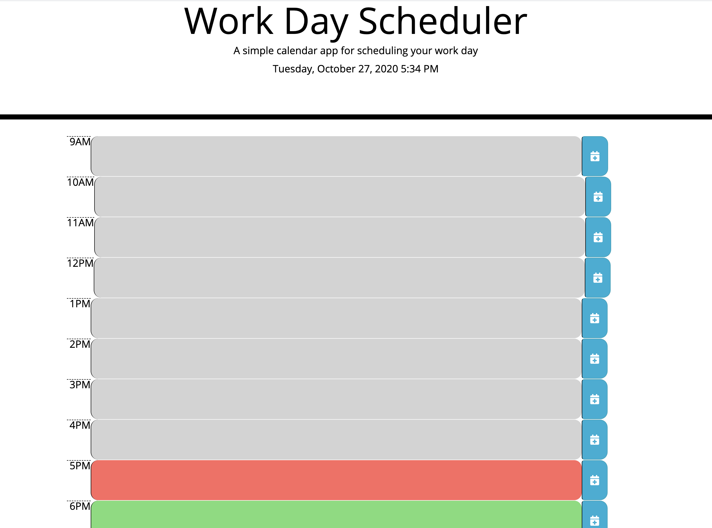

# yourworkday

## What it is

YourWorkDay is a simple day planner interface to write all your todos of the day from 9 am to 6 pm. As the day goes on each hour block will go from grey to let you know its passed, your current hour will be displayed red to let you know what to do that hour and green for the rest of the hours coming up.

## Components

* current day, date and time of day displayed in header for easy tracking.
* time blocks for each hour of a typical work day from 9 am to 6 pm.
** time blocks will change color depending on current time of day.
* editable time blocks, just press save to the button to the right and your data will be saved even when you refresh.

## Website Example and Link

[Go to Live YourWorkday Page](https://beccablanton.github.io/yourworkday/)

